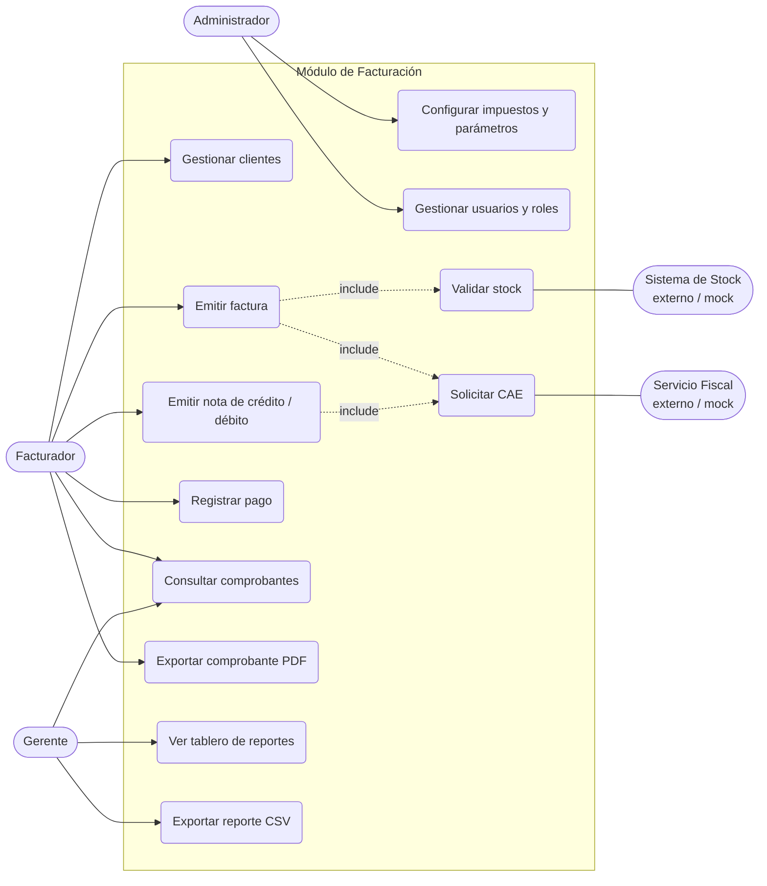
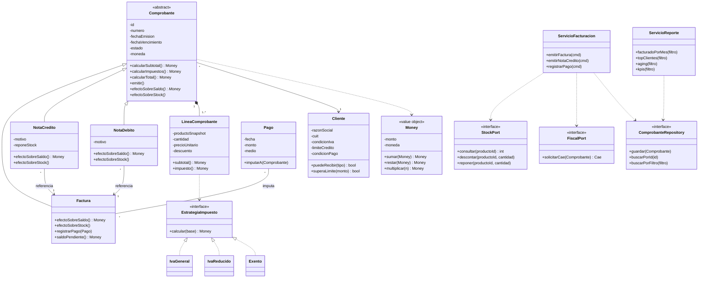
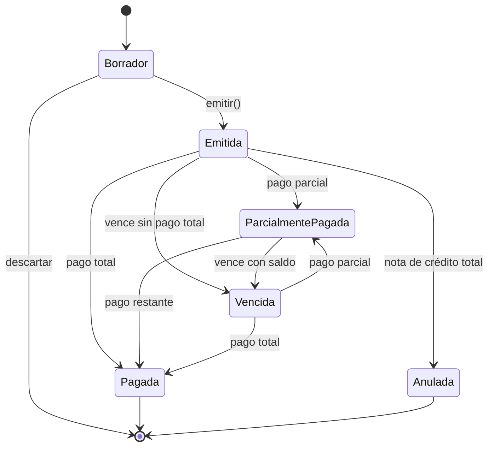
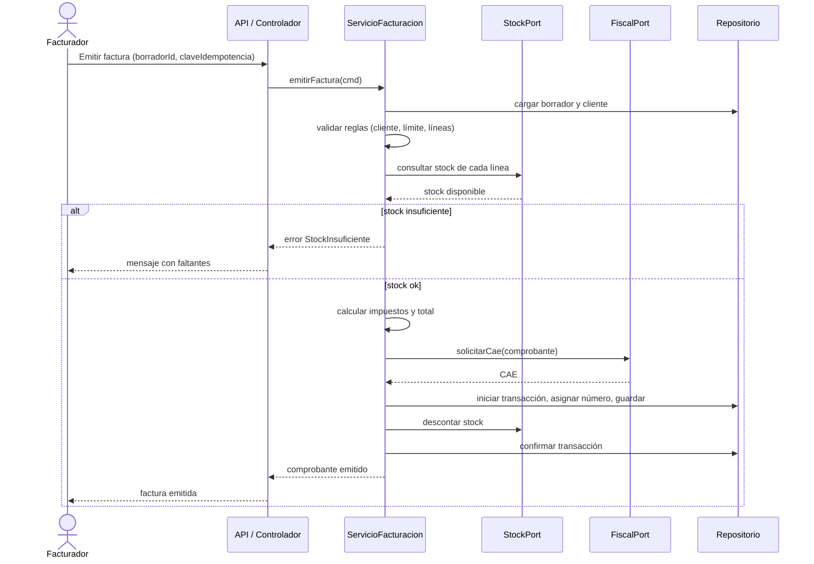

# Módulo de Facturación con Reporte Analítico

**Materia:** Ingeniería de Software 2 (FIUBA)
**Tipo de trabajo:** Análisis y diseño de un sistema aplicando Ingeniería de Software, Diseño Orientado a Objetos y Scrum
**Sistema elegido:** Ventas / Facturación (módulo centrado en una tarea, con reporte de visualización)


---

## Índice

1. Resumen de idea
2. Descripción del sistema
3. Requisitos
4. Casos borde y reglas críticas
5. Metodología Scrum
6. Diseño Orientado a Objetos
7. UML
8. Algoritmo
9. Patrón de diseño
10. Arquitectura y estructura del proyecto
11. Reporte de visualización (definiciones)
12. Análisis económico y flujo de fondos
14. Riesgos

---

## 1. Resumen de idea

**Problema.** En una pyme que vende productos con stock, la facturación suele ser manual y estar desconectada del inventario y de la cobranza. Esto genera errores de carga, ventas sin stock, cobranza reactiva y falta de visibilidad sobre el negocio.

**Solución.** Un módulo de facturación que:

1. Emite comprobantes (factura, nota de crédito, nota de débito) conectados al stock existente.
2. Controla el ciclo de cobro (pagos, saldos, vencimientos).
3. Transforma lo ingresado en un **tablero de gráficos** para la toma de decisiones, sin carga adicional.

**Enfoque.** No es un CRM completo. Es **un módulo robusto y con valor, centrado en una tarea**: facturar y entender qué se factura y qué se cobra. Los demás módulos (stock, usuarios, fiscal) existen y funcionan, pero parten de una base fija y mockeada.

**Por qué tiene sentido venderlo.** Es configurable (impuestos, monedas, condiciones de pago, numeración), está desacoplado de sistemas externos mediante interfaces y entrega valor medible (tiempo ahorrado, menos errores, cobranza más rápida).

---

## 2. Descripción del sistema

### 2.1 Objetivo

Permitir a una empresa emitir y gestionar comprobantes de venta de forma confiable, controlar su cobro y obtener reportes visuales sobre su facturación y cartera de clientes.

### 2.2 Problemática detallada

| Dolor actual | Consecuencia |
|---|---|
| Facturas armadas a mano o en planillas | Errores de precio, IVA o cliente; notas de crédito y retrabajo |
| Stock no verificado al facturar | Se vende lo que no hay, con reclamos posteriores |
| No hay visión de deuda por cliente | Mora detectada tarde, peor flujo de caja |
| Reportes armados manualmente | Horas perdidas y decisiones tardías |
| Sin trazabilidad de quién hizo qué | Difícil auditar o corregir |

### 2.3 Usuarios

| Usuario | Rol | Uso |
|---|---|---|
| Facturador / administrativo | Operativo | Diario: emite comprobantes, registra pagos |
| Gerente / dueño | Decisor | Consulta el tablero y las alertas |
| Administrador del sistema | Configuración | Impuestos, usuarios, parámetros |
| Contador (externo) | Consumidor de datos | Exportaciones (indirecto) |

### 2.4 Funciones principales

Ver sección 3.1 (requisitos funcionales). En resumen: clientes, emisión de comprobantes, control de stock, notas de crédito/débito, pagos, estados del comprobante, reporte con gráficos, exportación, roles y auditoría.

### 2.5 Alcance

**Incluido**
- Gestión de clientes (mínima).
- Emisión de factura, nota de crédito y nota de débito.
- Cálculo de impuestos y descuentos.
- Validación y descuento de stock al facturar.
- Registro de pagos totales y parciales.
- Ciclo de vida del comprobante.
- Reporte con gráficos y filtros.
- Exportación a PDF y CSV.
- Persistencia real (base de datos).
- Roles básicos y auditoría.

**Mockeado pero funcional** (existe y responde, con datos fijos)
- Módulo de inventario: base precargada con productos, precios, costos y stock.
- Autenticación: usuarios de ejemplo con roles.
- Servicio fiscal: adaptador simulado que devuelve un CAE ficticio.

**Fuera de alcance**
- Contabilidad general, compras, logística.
- Integración real con ARCA (queda en el roadmap).
- Pasarelas de pago.
- Multiempresa completa.

### 2.6 Prerrequisitos y supuestos

- Existe un módulo de inventario con productos, precio, costo y stock, que expone consulta y descuento/reposición de stock.
- Los impuestos aplicables son conocidos (IVA 21%, 10,5%, 27%, exento) y configurables.
- Cada usuario tiene un rol asignado.
- Moneda principal ARS, con soporte opcional de USD y cotización manual.
- Existe un conjunto de datos de demo: 6 a 12 meses de facturas, 15 a 30 clientes, 30 a 60 productos, con todos los estados representados.
- Se cuenta con un entorno reproducible (Docker) para levantar el sistema.

### 2.7 Puntos de valor

| Valor | Indicador |
|---|---|
| Menos tiempo por factura | Minutos por comprobante, antes vs. después |
| Menos errores | % de comprobantes corregidos con nota de crédito |
| Cobranza más rápida | DSO y % de deuda vencida |
| Visibilidad inmediata | Tiempo para obtener un reporte (de horas a segundos) |
| Consistencia con el stock | Cero ventas sin stock disponible |
| Adaptabilidad | Agregar impuesto/moneda sin tocar el núcleo |

---

## 3. Requisitos

### 3.1 Requisitos funcionales

| ID | Requisito |
|---|---|
| RF-01 | El sistema debe permitir crear, editar y consultar clientes con CUIT, condición frente al IVA, límite de crédito y condición de pago. |
| RF-02 | El sistema debe permitir consultar productos y su stock desde el módulo de inventario. |
| RF-03 | El sistema debe permitir crear un comprobante en borrador seleccionando cliente y líneas de producto. |
| RF-04 | El sistema debe calcular automáticamente subtotales, descuentos, impuestos y total. |
| RF-05 | El sistema debe validar el stock disponible antes de emitir y descontarlo al emitir. |
| RF-06 | El sistema debe asignar numeración correlativa por tipo de comprobante y punto de venta. |
| RF-07 | El sistema debe impedir la modificación de un comprobante emitido. |
| RF-08 | El sistema debe permitir emitir notas de crédito y débito asociadas a un comprobante original. |
| RF-09 | El sistema debe reponer stock cuando una nota de crédito implique devolución de mercadería. |
| RF-10 | El sistema debe permitir registrar pagos totales o parciales e imputarlos a uno o más comprobantes. |
| RF-11 | El sistema debe gestionar los estados del comprobante: borrador, emitida, parcialmente pagada, pagada, vencida, anulada. |
| RF-12 | El sistema debe marcar como vencidos los comprobantes impagos según la condición de pago. |
| RF-13 | El sistema debe mostrar un reporte con gráficos: facturado vs. cobrado, top clientes, top productos, estado de cartera, aging de deuda y KPIs. |
| RF-14 | El sistema debe permitir filtrar el reporte por período, cliente, producto y moneda. |
| RF-15 | El sistema debe exportar comprobantes a PDF y reportes a CSV. |
| RF-16 | El sistema debe restringir funciones según el rol del usuario. |
| RF-17 | El sistema debe registrar en una auditoría las acciones críticas (emitir, anular, registrar pago, cambiar configuración). |
| RF-18 | El sistema debe permitir configurar impuestos, monedas, condiciones de pago y puntos de venta. |

### 3.2 Requisitos no funcionales

| ID | Atributo | Requisito medible |
|---|---|---|
| RNF-01 | Integridad y consistencia | Una emisión es atómica: o se emite, se numera y se descuenta stock, o no ocurre nada. |
| RNF-02 | Modificabilidad | Agregar un impuesto o moneda requiere cambios solo en configuración o en una nueva estrategia, sin modificar el núcleo. |
| RNF-03 | Rendimiento | El reporte carga en una velocidad aceptable, incluso con una gran carga de datos: ej 50000 registros
| RNF-05 | Usabilidad | Una factura simple se emite en no más de 5 pasos. |
| RNF-06 | Testeabilidad | Cobertura de tests del dominio mayor a 80%; el dominio se prueba sin base de datos. |
| RNF-07 | Mantenibilidad | Separación en capas; dependencias hacia el dominio, nunca al revés. |
| RNF-08 | Portabilidad | Levantar el sistema completo con un solo comando (Docker Compose). |
| RNF-09 | Trazabilidad | Logs estructurados de cada operación relevante con identificador de correlación. |

---

## 4. Casos borde y reglas críticas

### 4.1 Stock

| Caso | Tratamiento propuesto |
|---|---|
| Stock insuficiente | Bloquear la emisión, o advertir si la configuración permite venta sin stock |
| Dos usuarios facturan el mismo producto a la vez | Control de concurrencia (bloqueo o versionado optimista); el stock nunca queda negativo |
| Falla del módulo de stock a mitad de la emisión | La factura no queda emitida: transacción o compensación (revertir) |
| Producto dado de baja | Se conserva en comprobantes históricos; no se puede agregar a nuevos |

### 4.2 Precios y montos

| Caso | Tratamiento propuesto |
|---|---|
| El precio cambia entre borrador y emisión | El comprobante guarda una foto (snapshot) de descripción, precio e impuesto; al emitir se revalida y se avisa |
| Redondeo de impuestos | redondeo por linea |
| Descuento mayor al 100% o negativo | Rechazar |
| Cantidad cero o negativa | Rechazar |
| Total cero | permitir con aviso  |
| Representación del dinero | Nunca `float`; usar decimal con 2 cifras de centavos, guardando siempre la moneda |

### 4.3 Comprobantes

| Caso | Tratamiento propuesto |
|---|---|
| Doble click o reintento por timeout | Emisión idempotente con clave de idempotencia; no genera dos facturas |
| Saltos o duplicados en la numeración | Numeración asignada al emitir, dentro de la transacción |
| Corregir una factura emitida | No se edita; se emite nota de crédito |
| Nota de crédito mayor a la factura original | Rechazar |
| Varias notas de crédito sobre la misma factura | Validar que la suma no supere el total original |
| Cliente sin CUIT o condición fiscal incompatible | Restringir tipos de comprobante permitidos (según A, B o C) |
| Borrador abandonado | Política de expiración |

### 4.4 Cobranza

| Caso | Tratamiento propuesto |
|---|---|
| Pago mayor al saldo | registrar saldo a favor |
| Pago parcial y luego nota de crédito | Recalcular saldo pendiente correctamente |
| Pago imputado a varias facturas | Definir orden de imputación (más antigua primero, configurable) |
| Vencimiento en fin de semana o feriado |  trasladar la fecha límite de pago al primer día hábil siguiente |
| Cliente supera su límite de crédito | bloquear |
| Pago en moneda distinta a la factura | Usar cotización registrada y guardar la diferencia como saldo a favor |

### 4.5 Reporte

| Caso | Tratamiento propuesto |
|---|---|
| Período sin datos | Mostrar estado vacío con mensaje claro |
| Gran volumen de datos | Consultas agregadas en base de datos, índices, y tablas resumen o vistas materializadas si hace falta |
| Devengado vs. percibido | "Facturado" es lo emitido; "Cobrado" es lo pagado; no se mezclan |
| Notas de crédito | Restan del facturado en el período en que se emiten  |
| Zona horaria y corte de mes | Definir zona horaria única America/Argentina/Buenos_Aires  |
| Datos mockeados del stock | El reporte debe funcionar igual si cambia el origen de datos  |

---

## 5. Metodología Scrum

### 5.1 Roles

| Rol | Responsabilidad |
|---|---|
| Product Owner | Representa al negocio (dueño o gerente), prioriza el Product Backlog y define criterios de aceptación |
| Scrum Master | Facilita el proceso, elimina impedimentos, cuida las ceremonias |
| Equipo de desarrollo | Diseña, implementa, prueba y entrega el incremento |

### 5.2 Ceremonias y artefactos

- **Sprint:** 2 semanas.
- **Sprint Planning** (inicio): se elige el Sprint Backlog.
- **Daily** (15 min): qué hice, qué haré, qué me bloquea.
- **Sprint Review** (fin): demo del incremento al Product Owner.
- **Retrospectiva** (fin): qué mejorar del proceso.
- **Product Backlog:** lista priorizada de todo lo que se quiere construir.
- **Sprint Backlog:** historias y tareas comprometidas para el sprint.
- **Definition of Done:** código con tests pasando, criterios de aceptación cumplidos, revisado por un par, integrado y desplegable con Docker, documentación mínima actualizada.

### 5.3 Product Backlog (priorizado)

| Prioridad | ID | Historia | Puntos (estimación) |
|---|---|---|---|
| 1 | HU-01 | Emitir una factura | 8 |
| 2 | HU-02 | Validar stock al facturar | 5 |
| 3 | HU-03 | Corregir con nota de crédito | 5 |
| 4 | HU-04 | Registrar pagos parciales y totales | 5 |
| 5 | HU-05 | Ver tablero de facturado vs. cobrado | 8 |
| 6 | HU-06 | Ver antigüedad de deuda (aging) | 5 |
| 7 | HU-07 | Configurar impuestos y condiciones de pago | 5 |
| 8 | HU-08 | Gestionar clientes | 3 |
| 9 | HU-09 | Exportar comprobante a PDF y reportes a CSV | 3 |
| 10 | HU-10 | Roles y permisos | 3 |
| 11 | HU-11 | Auditoría de acciones críticas | 3 |

### 5.4 Historias de usuario con criterios de aceptación

**HU-01 — Emitir una factura**
Como facturador, quiero emitir una factura seleccionando un cliente y productos, para registrar y cobrar una venta.
- *Dado* un cliente válido y al menos una línea con stock, *cuando* emito la factura, *entonces* se asigna número correlativo, se calculan impuestos y total, y el estado pasa a "emitida".
- *Dado* una factura emitida, *cuando* intento editarla, *entonces* el sistema lo impide.

**HU-02 — Validar stock**
Como facturador, quiero que el sistema avise si no hay stock suficiente, para no vender lo que no tengo.
- *Dado* un producto con stock 3, *cuando* intento facturar 5, *entonces* el sistema informa el faltante y no emite (según configuración).
- *Dado* una emisión exitosa, *entonces* el stock se descuenta en la cantidad facturada.

**HU-03 — Nota de crédito**
Como facturador, quiero corregir una factura errónea con una nota de crédito, para no alterar comprobantes emitidos.
- *Dado* una factura emitida, *cuando* emito una nota de crédito por un monto menor o igual, *entonces* el saldo se ajusta y queda asociada a la factura original.
- *Dado* una nota de crédito con devolución de mercadería, *entonces* el stock se repone.

**HU-04 — Pagos**
Como administrativo, quiero registrar pagos parciales, para conocer el saldo real de cada cliente.
- *Dado* una factura de $1000, *cuando* registro un pago de $400, *entonces* el estado es "parcialmente pagada" y el saldo es $600.
- *Dado* un pago que completa el saldo, *entonces* el estado pasa a "pagada".

**HU-05 — Tablero**
Como gerente, quiero ver un tablero de facturado vs. cobrado por mes, para decidir sobre la cobranza.
- *Dado* un período seleccionado, *entonces* se muestran los gráficos y KPIs correspondientes con los datos reales de la base.
- *Dado* un período sin datos, *entonces* se muestra un mensaje claro.

**HU-06 — Aging**
Como gerente, quiero ver la antigüedad de la deuda, para priorizar reclamos.
- *Dado* facturas vencidas, *entonces* se agrupan por tramos (0-30, 31-60, 61-90, +90 días) y por cliente.

**HU-07 — Configuración**
Como administrador, quiero configurar impuestos y condiciones de pago, para adaptar el sistema sin depender de un programador.
- *Dado* un nuevo impuesto configurado, *cuando* se factura, *entonces* se aplica sin modificar código.

### 5.5 Plan de sprints

| Sprint | Objetivo | Historias | Tareas principales |
|---|---|---|---|
| 1 | Base y dominio | HU-08, inicio HU-01 | Modelo de dominio, esquema de BD y migraciones, seed de datos, CI, Docker, ABM de clientes |
| 2 | Emisión con stock | HU-01, HU-02 | Casos de uso de emisión, adaptador de stock mock, numeración, cálculo de impuestos (Strategy), tests de dominio |
| 3 | Cobranza y correcciones | HU-03, HU-04 | Notas de crédito/débito, pagos, estados, vencimientos |
| 4 | Reporte | HU-05, HU-06, HU-09 | Consultas de agregación, API de reportes, gráficos, filtros, exportaciones |
| 5 | Cierre y calidad | HU-07, HU-10, HU-11 | Configuración, roles, auditoría, hardening, pruebas end-to-end, guion de demo |

---

## 6. Diseño Orientado a Objetos

### 6.1 Clases principales y responsabilidades

| Clase | Atributos principales | Métodos principales | Responsabilidad |
|---|---|---|---|
| `Comprobante` (abstracta) | id, numero, tipo, fechaEmision, fechaVencimiento, estado, cliente, lineas, moneda | calcularSubtotal(), calcularImpuestos(), calcularTotal(), emitir(), efectoSobreSaldo(), efectoSobreStock() | Encapsular las reglas comunes de un comprobante |
| `Factura` | (hereda) | efectoSobreSaldo(), registrarPago() | Comprobante que genera una deuda |
| `NotaCredito` | facturaOriginal, motivo, reponeStock | efectoSobreSaldo(), efectoSobreStock() | Reduce el saldo y opcionalmente repone stock |
| `NotaDebito` | facturaOriginal, motivo | efectoSobreSaldo() | Aumenta el saldo (ajustes, intereses) |
| `LineaComprobante` | producto (snapshot), cantidad, precioUnitario, descuento, alicuota | subtotal(), impuesto() | Representar un renglón con datos congelados |
| `Cliente` | id, razonSocial, cuit, condicionIva, limiteCredito, condicionPago | puedeRecibir(tipoComprobante), superaLimite(monto) | Datos y reglas del cliente |
| `Pago` | id, fecha, monto, moneda, medio, imputaciones | imputarA(comprobante) | Registrar un cobro |
| `Imputacion` | pago, comprobante, monto | — | Vincular un pago con un comprobante |
| `Money` (value object) | monto, moneda | sumar(), restar(), multiplicar(), redondear() | Representar dinero de forma segura e inmutable |
| `EstrategiaImpuesto` (interfaz) | — | calcular(base) | Calcular un impuesto según una regla |
| `IvaGeneral`, `IvaReducido`, `Exento` | alicuota | calcular(base) | Implementaciones concretas |
| `ServicioFacturacion` (caso de uso) | repositorios y puertos | emitirFactura(), emitirNotaCredito(), registrarPago() | Orquestar la lógica de aplicación |
| `ServicioReporte` | repositorio de reportes | facturadoPorMes(), topClientes(), aging(), kpis() | Calcular agregaciones para el tablero |
| `StockPort` (interfaz) | — | consultarStock(), descontar(), reponer() | Abstraer el módulo de inventario |
| `FiscalPort` (interfaz) | — | solicitarCae(comprobante) | Abstraer el servicio fiscal |
| `ComprobanteRepository` (interfaz) | — | guardar(), buscarPorId(), buscarPorFiltro() | Abstraer la persistencia |

### 6.2 Aplicación de los pilares de la POO

- **Encapsulamiento:** `Money` es inmutable y no permite operar monedas distintas sin conversión explícita. `Comprobante` calcula sus totales internamente y no expone setters de estado; solo transiciones válidas (`emitir()`, `anular()`).
- **Herencia:** `Factura`, `NotaCredito` y `NotaDebito` extienden `Comprobante`, compartiendo líneas, cálculo de totales y ciclo de vida. Se usa herencia solo donde hay una relación "es un"; el resto se resuelve por composición.
- **Polimorfismo:** cada comprobante implementa `efectoSobreSaldo()` y `efectoSobreStock()` a su manera; el servicio los trata de forma uniforme. Las estrategias de impuestos se intercambian sin que el comprobante conozca el detalle.
- **Modularidad:** dominio, aplicación, puertos y adaptadores en módulos separados; el dominio no depende de infraestructura.

---

## 7. UML

> Los diagramas usan sintaxis **Mermaid** (se renderizan en GitHub, GitLab, VS Code con extensión, Obsidian, etc.). Pueden trasladarse a draw.io, StarUML o PlantUML para la entrega final.

### 7.1 Diagrama de casos de uso



### 7.2 Diagrama de clases



### 7.3 Diagrama de estados del comprobante



### 7.4 Diagrama de secuencia: emitir factura



---

## 9. Patrón de diseño

### 9.1 Patrón principal: Strategy (cálculo de impuestos y descuentos)

**Problema.** Los impuestos varían (IVA 21%, 10,5%, 27%, exento, percepciones) y pueden cambiar o agregarse. Un `if/else` gigante dentro de `Comprobante` obligaría a modificarlo cada vez.

**Solución.** Definir una interfaz `EstrategiaImpuesto` con un método `calcular(base)` y una clase por regla. La línea o el comprobante recibe la estrategia adecuada sin conocer su detalle.

```
interfaz EstrategiaImpuesto:
    calcular(base: Money) -> Money

clase IvaGeneral implementa EstrategiaImpuesto:
    calcular(base) -> base * 0.21

clase IvaReducido implementa EstrategiaImpuesto:
    calcular(base) -> base * 0.105

clase Exento implementa EstrategiaImpuesto:
    calcular(base) -> 0
```

**Beneficios.**
- **Abierto/cerrado:** agregar un impuesto = agregar una clase o una configuración, sin tocar el núcleo (RNF-02).
- Cada estrategia se prueba de forma aislada.
- Elimina condicionales complejos.

### 9.2 Patrones complementarios

| Patrón | Dónde se aplica | Beneficio |
|---|---|---|
| **Observer** | `FacturaEmitida` notifica a auditoría, reporte y otros módulos | Desacoplamiento entre emisión y efectos secundarios |
| **Factory** | Creación del comprobante según tipo de cliente y operación (A, B, C, nota de crédito, etc.) | Centraliza reglas de creación |
| **Repository** | Acceso a datos detrás de `ComprobanteRepository` | El dominio no conoce la base de datos |
| **State** | Ciclo de vida del comprobante | Transiciones válidas explícitas |
| **Adapter** | Módulo de stock y servicio fiscal mockeados o reales | Se reemplaza el mock sin cambiar el dominio |

**Singleton:** evitarlo salvo para configuración; complica los tests y la concurrencia.

---

## 10. Arquitectura y estructura del proyecto

### 10.1 Estilo arquitectónico

**Monolito modular con arquitectura hexagonal (puertos y adaptadores).**

- Más simple de desarrollar y desplegar que microservicios para este tamaño.
- Los módulos externos quedan detrás de puertos: "mockear" es simplemente usar otro adaptador.
- Evolucionable: cada módulo podría extraerse a un servicio en el futuro.
- Coherente con el enfoque de la cátedra (arquitectura hexagonal, tests de integración, CI/CD).

```
┌────────────────────────────────────────────────┐
│  Presentación: Web (SPA)  ──►  API REST        │
├────────────────────────────────────────────────┤
│  Aplicación: casos de uso                      │
│  EmitirFactura · EmitirNotaCredito ·           │
│  RegistrarPago · ObtenerReporte                │
├────────────────────────────────────────────────┤
│  Dominio (sin dependencias externas)           │
│  Comprobante, Cliente, Pago, Money,            │
│  Estrategias de impuesto, eventos              │
├────────────────────────────────────────────────┤
│  Puertos (interfaces)                          │
│  StockPort · FiscalPort · Repositorios · Reloj │
├────────────────────────────────────────────────┤
│  Adaptadores                                   │
│  StockMock (BD precargada) · FiscalMock (CAE)  │
│  PostgreSQL · Reloj del sistema · PDF/CSV      │
└────────────────────────────────────────────────┘
```

### 10.2 Stack sugerido (adaptable a lo que domine el equipo)

| Capa | Opción sugerida |
|---|---|
| Backend | Python + FastAPI (o Node/Java/Go) |
| Base de datos | PostgreSQL con migraciones (Alembic o equivalente) |
| Frontend | React / Next.js + librería de gráficos (Recharts o Chart.js) |
| Tests | pytest (o equivalente): unitarios de dominio, integración, e2e |
| Infraestructura | Docker + Docker Compose |
| CI | GitHub Actions o GitLab CI: lint, tests, build |
| Observabilidad | Logs estructurados y métricas básicas |

### 10.3 Estructura de carpetas

```
facturacion/
├── domain/                  # entidades, value objects, reglas, eventos
│   ├── comprobante/
│   ├── cliente/
│   ├── pago/
│   ├── impuestos/           # estrategias
│   └── money.py
├── application/             # casos de uso y DTOs
│   ├── emitir_factura.py
│   ├── emitir_nota_credito.py
│   ├── registrar_pago.py
│   └── obtener_reporte.py
├── ports/                   # interfaces
│   ├── stock_port.py
│   ├── fiscal_port.py
│   └── repositorios.py
├── adapters/
│   ├── persistence/         # repositorios SQL, migraciones
│   ├── stock_mock/          # base de stock precargada
│   ├── fiscal_mock/         # emisor de CAE simulado
│   ├── api/                 # controladores REST
│   └── export/              # PDF y CSV
├── reporting/               # consultas y agregaciones del tablero
├── web/                     # frontend
├── seed/                    # datos de demo (stock, clientes, facturas)
├── tests/
│   ├── unit/                # dominio sin BD
│   ├── integration/         # repositorios y API
│   └── e2e/                 # flujos completos
├── docs/                    # UML, backlog, análisis económico
├── docker-compose.yml
└── README.md
```

### 10.4 Modelo de datos (tablas principales)

`cliente`, `producto_snapshot` (o datos embebidos en línea), `comprobante`, `linea_comprobante`, `pago`, `imputacion`, `impuesto` (configuración), `punto_venta` (con contador de numeración), `usuario`, `rol`, `auditoria`, `operacion_idempotente`.
Y, del módulo mockeado: `producto` y `stock` (precargados).

Índices recomendados: `comprobante(fecha_emision)`, `comprobante(cliente_id, estado)`, `comprobante(fecha_vencimiento, estado)`, y unicidad de `(tipo, punto_venta, numero)`.

### 10.5 Decisiones de diseño clave para justificar

1. **Hexagonal**, para reemplazar mocks por sistemas reales sin tocar el dominio.
2. **Snapshot de datos del producto en la línea**, para que el historial no dependa del catálogo.
3. **Comprobantes inmutables** y corrección por nota de crédito, por integridad y trazabilidad.
4. **Dinero como decimal/entero con moneda**, para evitar errores de redondeo.
5. **Transacción atómica en la emisión** (numeración, stock, estado), por consistencia.
6. **Reporte por consultas agregadas en la base de datos**, por rendimiento.

---

## 11. Reporte de visualización (definiciones)

### 11.1 Gráficos

| Gráfico | Tipo | Pregunta de negocio que responde |
|---|---|---|
| Facturado vs. cobrado por mes | Barras agrupadas o línea | ¿Cobramos lo que facturamos? |
| Top clientes por facturación | Barras horizontales | ¿De quién depende el ingreso? |
| Top productos por facturación (y cantidad) | Barras | ¿Qué se vende más? |
| Estado de cartera | Torta o donut | ¿Cuánto está pagado, pendiente y vencido? |
| Aging de deuda | Barras apiladas por tramo | ¿Qué tan vieja es la deuda? |
| Evolución de deuda vencida | Línea | ¿Mejora o empeora la cobranza? |

### 11.2 KPIs

| KPI | Definición |
|---|---|
| Total facturado | Suma de facturas y notas de débito emitidas, menos notas de crédito, en el período |
| Total cobrado | Suma de pagos imputados en el período |
| Saldo pendiente | Facturado menos cobrado (a la fecha de corte) |
| Deuda vencida | Saldo de comprobantes con vencimiento anterior a la fecha de corte |
| DSO | (Saldo pendiente / Facturado del período) × días del período |
| Ticket promedio | Total facturado / cantidad de comprobantes |
| Concentración | % del facturado que representan los 5 principales clientes |
| Margen bruto (extra) | Ingreso menos costo del producto (usa el costo del stock) |

### 11.3 Filtros

Período, cliente, producto, moneda, estado del comprobante.

> **Decisión a documentar:** los KPIs se calculan sobre datos persistidos y consultas agregadas; el reporte no debe depender de que el stock sea mock.

---

## 12. Análisis económico y flujo de fondos

> **Importante:** todos los valores son **supuestos ilustrativos** en USD (se recomienda modelar en moneda estable por el contexto inflacionario). El grupo debe reemplazarlos por supuestos propios y justificados. El modelo es simplificado: no incluye impuesto a las ganancias ni amortizaciones.

### 12.1 Empresa de referencia (hipotética)

- Pyme comercial que emite **1.000 comprobantes por mes** (12.000 por año).
- Ticket promedio **USD 150**, ventas anuales **USD 1.800.000**.
- DSO actual: **45 días**.
- Costo hora administrativo: **USD 6**.
- Costo financiero del capital de trabajo: **20% anual**.

### 12.2 Inversión inicial (año 0)

| Concepto | Cálculo | USD |
|---|---|---|
| Desarrollo | 4 personas × 10 semanas × 20 h = 800 h × USD 15 | 12.000 |
| Infraestructura inicial | Entornos, dominio, certificados | 500 |
| Capacitación y puesta en marcha | | 500 |
| **Total inversión** | | **13.000** |

### 12.3 Costos anuales de operación

| Concepto | USD/año |
|---|---|
| Hosting y base de datos | 600 |
| Mantenimiento y soporte (15% de la inversión) | 1.950 |
| **Total** | **2.550** |

### 12.4 Beneficios anuales (a régimen)

| Beneficio | Cálculo | USD/año |
|---|---|---|
| Ahorro de tiempo de facturación | 12.000 facturas × 6 min ahorrados = 1.200 h × USD 6 | 7.200 |
| Menos notas de crédito por error | 12.000 × 5% = 600 NC actuales; reducción del 60% = 360 evitadas × USD 8 de retrabajo | 2.880 |
| Mejor cobranza | Ventas diarias ≈ USD 4.932; DSO baja de 45 a 38 días (7 días) → capital liberado ≈ USD 34.521; × 20% costo financiero | 6.904 |
| **Total a régimen** | | **16.984** |

Curva de adopción: el año 1 se considera al **70%** del beneficio (implantación gradual).

### 12.5 Flujo de fondos (escenario base, 3 años)

| Concepto | Año 0 | Año 1 | Año 2 | Año 3 |
|---|---|---|---|---|
| Inversión | −13.000 | | | |
| Beneficios | | 11.889 | 16.984 | 16.984 |
| Costos operativos | | −2.550 | −2.550 | −2.550 |
| **Flujo neto** | **−13.000** | **9.339** | **14.434** | **14.434** |
| Flujo acumulado | −13.000 | −3.661 | 10.773 | 25.207 |

### 12.6 Indicadores (tasa de descuento 12%)

| Indicador | Resultado aproximado |
|---|---|
| VAN | ≈ USD 17.100 |
| TIR | ≈ 73% |
| Período de recuperación (payback) | ≈ 1,25 años (unos 15 meses) |

### 12.7 Análisis de sensibilidad

| Escenario | Supuesto | VAN aprox. | Payback aprox. |
|---|---|---|---|
| Pesimista | Beneficios −40% | ≈ USD 2.600 | ≈ 2,1 años |
| Base | Según tablas anteriores | ≈ USD 17.100 | ≈ 1,25 años |
| Optimista | Beneficios +20% | ≈ USD 24.400 | ≈ 1,1 años |

Incluso en el escenario pesimista el VAN es positivo, lo cual es un buen argumento ante el directivo. Otros riesgos a sensibilizar: mayor costo de desarrollo (+30%) y menor adopción.

### 12.8 Relación con Scrum y UML (para la conclusión)

Un diseño claro (UML) y un proceso iterativo (Scrum) reducen el costo del proyecto porque detectan errores de requisitos temprano (corregir en diseño es mucho más barato que en producción), permiten priorizar por valor y entregar incrementos utilizables, y dejan una base modificable que reduce el costo de mantenimiento.

---

## 14. Riesgos

| Riesgo | Probabilidad | Impacto | Mitigación |
|---|---|---|---|
| Alcance excesivo | Alta | Alto | MVP acotado, backlog priorizado, roadmap para el resto |
| Errores de cálculo de impuestos y redondeo | Media | Alto | Tests exhaustivos, `Money` inmutable, regla única de redondeo |
| Inconsistencia con el stock | Media | Alto | Transacción y compensación, tests de concurrencia |
| Dashboard lento con muchos datos | Media | Medio | Consultas agregadas, índices, tablas resumen |
| Baja adopción del usuario | Media | Alto | Usabilidad (pocos pasos), capacitación, implantación gradual |
| Cambios normativos fiscales | Media | Medio | Fiscal aislado detrás de un puerto |
| Falla en la demo en vivo | Media | Alto | Datos precargados, guion, video de respaldo |

---
